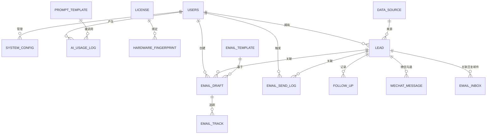

# MVP 数据库表设计

> 对应《MVP 核心功能规划》五大模块：潜客挖掘、邮件生成发送、License 验证、AI 能力中台、基础支撑
> 说明：MVP 阶段使用 SQLite（零运维），字段采用标准类型便于后续平滑迁移 PostgreSQL

## 一、表关系总览



## 二、表结构明细

### 2.1 users（用户账号）

| 字段          | 类型         | 约束                       | 说明                 |
| :------------ | :----------- | :------------------------- | :------------------- |
| id            | INTEGER      | PK, AUTOINCREMENT          | 主键                 |
| username      | VARCHAR(64)  | UNIQUE, NOT NULL           | 登录名               |
| password_hash | VARCHAR(128) | NOT NULL                   | BCrypt 哈希          |
| display_name  | VARCHAR(64)  |                            | 显示名               |
| role          | VARCHAR(20)  | NOT NULL, DEFAULT 'admin'  | 角色（MVP 仅 admin） |
| status        | VARCHAR(20)  | NOT NULL, DEFAULT 'active' | active / disabled    |
| created_at    | TIMESTAMP    | NOT NULL                   | 创建时间             |
| last_login_at | TIMESTAMP    |                            | 最后登录时间         |

**索引**：`uk_users_username(username)`

### 2.2 license（授权信息）

| 字段         | 类型        | 约束                         | 说明                                  |
| :----------- | :---------- | :--------------------------- | :------------------------------------ |
| id           | INTEGER     | PK, AUTOINCREMENT            | 主键                                  |
| license_key  | VARCHAR(64) | UNIQUE, NOT NULL             | 激活码                                |
| edition      | VARCHAR(20) | NOT NULL                     | 版本：basic / pro / enterprise        |
| activated_at | TIMESTAMP   |                              | 激活时间                              |
| expire_at    | TIMESTAMP   |                              | 到期时间（null=永久）                 |
| status       | VARCHAR(20) | NOT NULL, DEFAULT 'inactive' | inactive / active / expired / revoked |
| max_devices  | INTEGER     | NOT NULL, DEFAULT 1          | 允许绑定设备数                        |
| created_at   | TIMESTAMP   | NOT NULL                     | 记录创建时间                          |

**索引**：`uk_license_key(license_key)`

### 2.3 hardware_fingerprint（设备指纹绑定）

| 字段             | 类型         | 约束                      | 说明             |
| :--------------- | :----------- | :------------------------ | :--------------- |
| id               | INTEGER      | PK, AUTOINCREMENT         | 主键             |
| license_id       | INTEGER      | FK → license.id, NOT NULL | 关联授权         |
| fingerprint_hash | VARCHAR(128) | UNIQUE, NOT NULL          | 设备指纹 SHA-256 |
| device_name      | VARCHAR(128) |                           | 设备描述         |
| bound_at         | TIMESTAMP    | NOT NULL                  | 绑定时间         |
| last_seen_at     | TIMESTAMP    |                           | 最近活跃时间     |

**索引**：`uk_fp_hash(fingerprint_hash)`；`idx_fp_license(license_id)`

### 2.4 data_source（数据源配置）

| 字段              | 类型         | 约束                | 说明                             |
| :---------------- | :----------- | :------------------ | :------------------------------- |
| id                | INTEGER      | PK, AUTOINCREMENT   | 主键                             |
| name              | VARCHAR(64)  | NOT NULL            | 数据源名称                       |
| type              | VARCHAR(32)  | NOT NULL            | 类型（如 qichacha / tianyancha） |
| api_base_url      | VARCHAR(255) |                     | API 地址                         |
| api_key_encrypted | VARCHAR(255) |                     | 加密存储的 API Key               |
| enabled           | BOOLEAN      | NOT NULL, DEFAULT 0 | 是否启用                         |
| created_at        | TIMESTAMP    | NOT NULL            | 创建时间                         |

**索引**：`idx_ds_type(type)`

### 2.5 lead（潜客）

| 字段            | 类型         | 约束                    | 说明                                               |
| :-------------- | :----------- | :---------------------- | :------------------------------------------------- |
| id              | INTEGER      | PK, AUTOINCREMENT       | 主键                                               |
| company_name    | VARCHAR(128) | NOT NULL                | 公司名称                                           |
| contact_name    | VARCHAR(64)  |                         | 联系人                                             |
| contact_email   | VARCHAR(128) |                         | 联系邮箱                                           |
| contact_phone   | VARCHAR(32)  |                         | 联系电话                                           |
| wechat_id       | VARCHAR(64)  |                         | 微信号（V11 新增）                                 |
| wechat_name     | VARCHAR(64)  |                         | 微信昵称（V11 新增）                               |
| gender          | VARCHAR(16)  |                         | 性别（男/女，空=未知，V6 新增）                    |
| industry        | VARCHAR(64)  |                         | 行业                                               |
| region          | VARCHAR(64)  |                         | 地区                                               |
| scale           | VARCHAR(32)  |                         | 规模（如 1-50 / 51-200）                           |
| website         | VARCHAR(255) |                         | 官网                                               |
| address         | VARCHAR(255) |                         | 公司地址（V7 新增）                                |
| stock_code      | VARCHAR(32)  |                         | 股票代码，如已上市（V7 新增）                      |
| source_type     | VARCHAR(32)  | NOT NULL                | 来源：api / csv / manual                           |
| source_id       | VARCHAR(64)  |                         | 数据源中的原始 ID（去重用）                        |
| profile_score   | INTEGER      | DEFAULT 0               | RAG 画像匹配分 0-100                               |
| profile_summary | TEXT         |                         | AI 画像摘要                                        |
| status          | VARCHAR(20)  | NOT NULL, DEFAULT 'new' | new / contacted / interested / converted / invalid |
| notes           | TEXT         |                         | 人工备注                                           |
| created_at      | TIMESTAMP    | NOT NULL                | 创建时间                                           |
| updated_at      | TIMESTAMP    | NOT NULL                | 更新时间                                           |

**索引**：`idx_lead_status(status)`；`idx_lead_email(contact_email)`；`uk_lead_source(source_type, source_id)`

### 2.6 follow_up（跟进记录）

> M2-1.5 新增：客户跟踪记录管理——每次触达客户的方式/内容/时间留痕

| 字段        | 类型        | 约束                      | 说明                                             |
| :---------- | :---------- | :------------------------ | :----------------------------------------------- |
| id          | INTEGER     | PK, AUTOINCREMENT         | 主键                                             |
| lead_id     | INTEGER     | FK → lead.id, NOT NULL    | 关联潜客                                         |
| method      | VARCHAR(32) | NOT NULL, DEFAULT 'other' | 触达方式：phone / email / wechat / visit / other |
| content     | TEXT        | NOT NULL                  | 跟进内容                                         |
| happened_at | TIMESTAMP   | NOT NULL, DEFAULT NOW()   | 跟进时间（可手动指定）                           |
| created_at  | TIMESTAMP   | NOT NULL, DEFAULT NOW()   | 创建时间                                         |
| updated_at  | TIMESTAMP   | NOT NULL, DEFAULT NOW()   | 更新时间                                         |

**索引**：`idx_fu_lead(lead_id)`

### 2.7 customer_profile（自有客户画像，RAG 语料）

| 字段          | 类型          | 约束              | 说明                        |
| :------------ | :------------ | :---------------- | :-------------------------- |
| id            | INTEGER       | PK, AUTOINCREMENT | 主键                        |
| company_name  | VARCHAR(128)  | NOT NULL          | 公司名称                    |
| industry      | VARCHAR(64)   |                   | 行业                        |
| contact_name  | VARCHAR(64)   |                   | 联系人                      |
| contact_email | VARCHAR(128)  |                   | 邮箱                        |
| deal_value    | DECIMAL(12,2) |                   | 成交金额                    |
| tags          | VARCHAR(255)  |                   | 标签（逗号分隔）            |
| description   | TEXT          |                   | 描述/画像文本（用于向量化） |
| embedding     | BLOB          |                   | 向量（MVP 可存 json 文本）  |
| created_at    | TIMESTAMP     | NOT NULL          | 创建时间                    |

**索引**：`idx_cp_email(contact_email)`

### 2.8 email_template（邮件模板）

| 字段       | 类型         | 约束                | 说明                              |
| :--------- | :----------- | :------------------ | :-------------------------------- |
| id         | INTEGER      | PK, AUTOINCREMENT   | 主键                              |
| name       | VARCHAR(64)  | NOT NULL            | 模板名                            |
| category   | VARCHAR(32)  | NOT NULL            | first_touch / follow_up / holiday |
| subject    | VARCHAR(255) | NOT NULL            | 主题（可含变量）                  |
| body       | TEXT         | NOT NULL            | 正文（可含变量）                  |
| variables  | TEXT         |                     | 变量清单（JSON）                  |
| builtin    | BOOLEAN      | NOT NULL, DEFAULT 0 | 是否预置模板                      |
| created_at | TIMESTAMP    | NOT NULL            | 创建时间                          |

**索引**：`idx_et_category(category)`

### 2.9 email_draft（AI 生成待确认邮件）

> M2-1.5 已实现：AI 生成结果可保存为草稿（status=draft），人工确认（status=confirmed，记录 confirmed_at）；
> 发送（sent）/ 拒绝（rejected）流转与 SMTP 发送属 M3 邮件闭环，本轮未实现

| 字段         | 类型         | 约束                      | 说明                                |
| :----------- | :----------- | :------------------------ | :---------------------------------- |
| id           | INTEGER      | PK, AUTOINCREMENT         | 主键                                |
| lead_id      | INTEGER      | FK → lead.id, NOT NULL    | 关联潜客                            |
| template_id  | INTEGER      | FK → email_template.id    | 基于模板                            |
| subject      | VARCHAR(255) | NOT NULL                  | 主题                                |
| body         | TEXT         | NOT NULL                  | 正文                                |
| tone         | VARCHAR(32)  | DEFAULT 'neutral'         | 语气：formal / friendly / neutral   |
| status       | VARCHAR(20)  | NOT NULL, DEFAULT 'draft' | draft / confirmed / sent / rejected |
| created_at   | TIMESTAMP    | NOT NULL                  | 创建时间                            |
| confirmed_at | TIMESTAMP    |                           | 人工确认时间                        |

**索引**：`idx_ed_lead(lead_id)`；`idx_ed_status(status)`

### 2.10 email_send_log（发送记录）

| 字段       | 类型         | 约束                | 说明                             |
| :--------- | :----------- | :------------------ | :------------------------------- |
| id         | INTEGER      | PK, AUTOINCREMENT   | 主键                             |
| lead_id    | INTEGER      | FK → lead.id        | 关联潜客                         |
| draft_id   | INTEGER      | FK → email_draft.id | 关联草稿                         |
| from_email | VARCHAR(128) | NOT NULL            | 发件邮箱                         |
| to_email   | VARCHAR(128) | NOT NULL            | 收件邮箱                         |
| subject    | VARCHAR(255) | NOT NULL            | 主题                             |
| body       | TEXT         | NOT NULL            | 正文快照                         |
| status     | VARCHAR(20)  | NOT NULL            | queued / sent / failed / bounced |
| error_msg  | VARCHAR(255) |                     | 失败原因                         |
| sent_at    | TIMESTAMP    |                     | 发送时间                         |
| created_at | TIMESTAMP    | NOT NULL            | 创建时间                         |

**索引**：`idx_esl_lead(lead_id)`；`idx_esl_status(status)`；`idx_esl_sent_at(sent_at)`

### 2.11 email_track（打开/点击追踪）

| 字段        | 类型         | 约束                             | 说明                               |
| :---------- | :----------- | :------------------------------- | :--------------------------------- |
| id          | INTEGER      | PK, AUTOINCREMENT                | 主键                               |
| send_log_id | INTEGER      | FK → email_send_log.id, NOT NULL | 关联发送记录                       |
| track_type  | VARCHAR(20)  | NOT NULL                         | open / click / reply / unsubscribe |
| track_token | VARCHAR(64)  | UNIQUE, NOT NULL                 | 追踪令牌（邮件内嵌链接）           |
| tracked_at  | TIMESTAMP    | NOT NULL                         | 事件时间                           |
| user_agent  | VARCHAR(255) |                                  | UA 信息                            |
| ip          | VARCHAR(64)  |                                  | IP                                 |

**索引**：`idx_etk_sendlog(send_log_id)`；`uk_etk_token(track_token)`

### 2.12 ai_usage_log（AI 用量记录）

| 字段              | 类型          | 约束                        | 说明                                    |
| :---------------- | :------------ | :-------------------------- | :-------------------------------------- |
| id                | INTEGER       | PK, AUTOINCREMENT           | 主键                                    |
| user_id           | INTEGER       | FK → users.id               | 操作人                                  |
| scene             | VARCHAR(32)   | NOT NULL                    | 场景：email_gen / lead_profile / search |
| model             | VARCHAR(32)   | NOT NULL                    | 模型名                                  |
| prompt_tokens     | INTEGER       | NOT NULL, DEFAULT 0         | 输入 token                              |
| completion_tokens | INTEGER       | NOT NULL, DEFAULT 0         | 输出 token                              |
| total_tokens      | INTEGER       | NOT NULL, DEFAULT 0         | 总 token                                |
| cost              | DECIMAL(10,6) | DEFAULT 0                   | 估算成本（元）                          |
| status            | VARCHAR(20)   | NOT NULL, DEFAULT 'success' | success / failed                        |
| created_at        | TIMESTAMP     | NOT NULL                    | 创建时间                                |

**索引**：`idx_aul_scene(scene)`；`idx_aul_created(created_at)`

### 2.13 prompt_template（Prompt 配置）

| 字段       | 类型        | 约束                | 说明                           |
| :--------- | :---------- | :------------------ | :----------------------------- |
| id         | INTEGER     | PK, AUTOINCREMENT   | 主键                           |
| scene      | VARCHAR(32) | UNIQUE, NOT NULL    | 场景：email_gen / lead_profile |
| name       | VARCHAR(64) | NOT NULL            | 名称                           |
| content    | TEXT        | NOT NULL            | Prompt 内容                    |
| version    | INTEGER     | NOT NULL, DEFAULT 1 | 版本号                         |
| enabled    | BOOLEAN     | NOT NULL, DEFAULT 1 | 是否启用                       |
| updated_at | TIMESTAMP   | NOT NULL            | 更新时间                       |

### 2.14 system_config（系统配置）

| 字段         | 类型         | 约束              | 说明                     |
| :----------- | :----------- | :---------------- | :----------------------- |
| id           | INTEGER      | PK, AUTOINCREMENT | 主键                     |
| config_key   | VARCHAR(64)  | UNIQUE, NOT NULL  | 配置键                   |
| config_value | TEXT         |                   | 配置值（加密存储敏感项） |
| description  | VARCHAR(255) |                   | 说明                     |
| updated_at   | TIMESTAMP    | NOT NULL          | 更新时间                 |

**典型配置项**：

| config_key                    | 说明                        | 敏感 |
| :---------------------------- | :-------------------------- | :--- |
| ai.provider                   | 模型提供商：deepseek / qwen | 否   |
| ai.api_key                    | 模型 API Key                | 是   |
| ai.model_name                 | 模型名                      | 否   |
| smtp.host / smtp.port         | SMTP 服务器                 | 否   |
| smtp.username / smtp.password | SMTP 账号密码               | 是   |
| mail.daily_limit              | 每账号每日发送上限          | 否   |
| mail.unsubscribe_url          | 退订链接前缀                | 否   |

### 2.15 email_inbox（收件箱：客户回复邮件，M2-1.6）

> 通过 MCP 协议从邮箱（IMAP / mock 模拟）抓取客户回复邮件并管理；
> provider=imap 时走 Jakarta Mail 读取真实邮箱，provider=mock 时读取内置模拟数据（无邮箱可验证全链路）

| 字段               | 类型         | 约束                             | 说明                                                     |
| :----------------- | :----------- | :------------------------------- | :------------------------------------------------------- |
| id                 | BIGINT       | PK, AUTOINCREMENT                | 主键                                                     |
| lead_id            | BIGINT       | FK → lead.id, ON DELETE SET NULL | 关联客户（按发件人邮箱自动匹配，可空）                   |
| mailbox            | VARCHAR(32)  | NOT NULL, DEFAULT 'INBOX'        | 邮箱文件夹（当前固定 INBOX）                             |
| uid                | BIGINT       | NOT NULL                         | 邮箱服务器 UID（与 mailbox 联合唯一去重）                |
| message_id         | VARCHAR(255) |                                  | 邮件 Message-ID                                          |
| from_address       | VARCHAR(255) | NOT NULL                         | 发件人邮箱                                               |
| from_name          | VARCHAR(128) |                                  | 发件人名称                                               |
| to_address         | VARCHAR(255) |                                  | 收件人邮箱                                               |
| subject            | VARCHAR(512) |                                  | 邮件主题                                                 |
| body               | TEXT         |                                  | 邮件正文                                                 |
| received_at        | TIMESTAMPTZ  | NOT NULL                         | 接收时间                                                 |
| is_read            | BOOLEAN      | NOT NULL, DEFAULT FALSE          | 是否已读（同步邮箱端状态）                               |
| ai_intent          | VARCHAR(32)  |                                  | AI 意图：inquiry/quote/objection/followup/positive/other |
| ai_summary         | VARCHAR(512) |                                  | AI 一句话摘要                                            |
| ai_analysis_status | VARCHAR(16)  | NOT NULL, DEFAULT 'pending'      | 分析状态：pending / analyzing / analyzed / failed        |
| created_at         | TIMESTAMPTZ  | NOT NULL                         | 创建时间                                                 |
| updated_at         | TIMESTAMPTZ  | NOT NULL                         | 更新时间                                                 |

**索引**：`uk_inbox_uid(mailbox, uid)`（同步去重）；`idx_inbox_lead(lead_id)`；`idx_inbox_received(received_at)`

**说明**：

- 同步：MCP `email_list_emails` → 按 (mailbox, uid) 去重 → 按发件人邮箱 `findFirstByContactEmailIgnoreCase` 自动关联 lead
- 管理：列表检索（关键词/未读/客户过滤）、详情、已读/未读、一键转跟进（follow_up）、AI 意图分析、删除
- 删除仅删除本地记录；下次同步时若邮箱端邮件仍存在会重新抓回（mock 模式已读/删除状态存于内存，重启后复位）

### 2.16 wechat_message（微信沟通消息，M2-1.8）

> 记录式微信工作台（先 A 后 B）：在系统中记录与客户的微信往来消息，AI 根据客户画像 + 沟通时间线生成回复建议，人工确认后复制到微信发送（人机协同红线）。
> 二期对接企业微信 API 真实收发时，仅替换收发通道，direction/content 结构不变。

| 字段       | 类型        | 约束                            | 说明                                                    |
| :--------- | :---------- | :------------------------------ | :------------------------------------------------------ |
| id         | BIGINT      | PK, AUTOINCREMENT               | 主键                                                    |
| lead_id    | BIGINT      | FK → lead.id, ON DELETE CASCADE | 关联客户                                                |
| direction  | VARCHAR(8)  | NOT NULL, DEFAULT 'in'          | 消息方向：in（客户发来）/ out（我方发出）               |
| content    | TEXT        | NOT NULL                        | 消息内容                                                |
| ai_reply   | TEXT        |                                 | AI 生成建议原文（out 且由 AI 建议确认发出时记录）       |
| status     | VARCHAR(20) | NOT NULL, DEFAULT 'recorded'    | recorded（直接记录）/ ai_confirmed（AI 建议确认后发出） |
| sent_at    | TIMESTAMPTZ | NOT NULL, DEFAULT NOW()         | 消息发生/发送时间（可手动指定）                         |
| created_at | TIMESTAMPTZ | NOT NULL, DEFAULT NOW()         | 创建时间                                                |
| updated_at | TIMESTAMPTZ | NOT NULL, DEFAULT NOW()         | 更新时间                                                |

**索引**：`idx_wm_lead(lead_id)`

**说明**：

- 记录：direction=in（客户发来的消息）直接记录；direction=out（我方发出的消息）可手工记录，也可由「AI 生成回复」建议确认后记录（status=ai_confirmed，ai_reply 存建议原文）
- AI 生成：`POST /api/leads/{leadId}/wechat-messages/suggest`，聚合客户画像 + 微信消息时间线（含微信方式跟进）注入 Prompt，返回回复建议文本，**不落库**，前端展示供人工编辑后确认发送
- 关联：follow_up.method=wechat 的跟进记录会纳入 AI 生成上下文时间线

## 三、SQLite 建表脚本（MVP 初始版）

```sql
-- 与上文一一对应，可直接执行
CREATE TABLE IF NOT EXISTS users (
  id INTEGER PRIMARY KEY AUTOINCREMENT,
  username VARCHAR(64) NOT NULL UNIQUE,
  password_hash VARCHAR(128) NOT NULL,
  display_name VARCHAR(64),
  role VARCHAR(20) NOT NULL DEFAULT 'admin',
  status VARCHAR(20) NOT NULL DEFAULT 'active',
  created_at TIMESTAMP NOT NULL DEFAULT CURRENT_TIMESTAMP,
  last_login_at TIMESTAMP
);

CREATE TABLE IF NOT EXISTS license (
  id INTEGER PRIMARY KEY AUTOINCREMENT,
  license_key VARCHAR(64) NOT NULL UNIQUE,
  edition VARCHAR(20) NOT NULL,
  activated_at TIMESTAMP,
  expire_at TIMESTAMP,
  status VARCHAR(20) NOT NULL DEFAULT 'inactive',
  max_devices INTEGER NOT NULL DEFAULT 1,
  created_at TIMESTAMP NOT NULL DEFAULT CURRENT_TIMESTAMP
);

CREATE TABLE IF NOT EXISTS hardware_fingerprint (
  id INTEGER PRIMARY KEY AUTOINCREMENT,
  license_id INTEGER NOT NULL REFERENCES license(id),
  fingerprint_hash VARCHAR(128) NOT NULL UNIQUE,
  device_name VARCHAR(128),
  bound_at TIMESTAMP NOT NULL DEFAULT CURRENT_TIMESTAMP,
  last_seen_at TIMESTAMP
);

CREATE TABLE IF NOT EXISTS data_source (
  id INTEGER PRIMARY KEY AUTOINCREMENT,
  name VARCHAR(64) NOT NULL,
  type VARCHAR(32) NOT NULL,
  api_base_url VARCHAR(255),
  api_key_encrypted VARCHAR(255),
  enabled BOOLEAN NOT NULL DEFAULT 0,
  created_at TIMESTAMP NOT NULL DEFAULT CURRENT_TIMESTAMP
);

CREATE TABLE IF NOT EXISTS lead (
  id INTEGER PRIMARY KEY AUTOINCREMENT,
  company_name VARCHAR(128) NOT NULL,
  contact_name VARCHAR(64),
  contact_email VARCHAR(128),
  contact_phone VARCHAR(32),
  gender VARCHAR(16),
  industry VARCHAR(64),
  region VARCHAR(64),
  scale VARCHAR(32),
  website VARCHAR(255),
  address VARCHAR(255),
  stock_code VARCHAR(32),
  source_type VARCHAR(32) NOT NULL,
  source_id VARCHAR(64),
  profile_score INTEGER DEFAULT 0,
  profile_summary TEXT,
  status VARCHAR(20) NOT NULL DEFAULT 'new',
  notes TEXT,
  created_at TIMESTAMP NOT NULL DEFAULT CURRENT_TIMESTAMP,
  updated_at TIMESTAMP NOT NULL DEFAULT CURRENT_TIMESTAMP,
  UNIQUE (source_type, source_id)
);

CREATE TABLE IF NOT EXISTS customer_profile (
  id INTEGER PRIMARY KEY AUTOINCREMENT,
  company_name VARCHAR(128) NOT NULL,
  industry VARCHAR(64),
  contact_name VARCHAR(64),
  contact_email VARCHAR(128),
  deal_value DECIMAL(12,2),
  tags VARCHAR(255),
  description TEXT,
  embedding TEXT,
  created_at TIMESTAMP NOT NULL DEFAULT CURRENT_TIMESTAMP
);

CREATE TABLE IF NOT EXISTS email_template (
  id INTEGER PRIMARY KEY AUTOINCREMENT,
  name VARCHAR(64) NOT NULL,
  category VARCHAR(32) NOT NULL,
  subject VARCHAR(255) NOT NULL,
  body TEXT NOT NULL,
  variables TEXT,
  builtin BOOLEAN NOT NULL DEFAULT 0,
  created_at TIMESTAMP NOT NULL DEFAULT CURRENT_TIMESTAMP
);

CREATE TABLE IF NOT EXISTS email_draft (
  id INTEGER PRIMARY KEY AUTOINCREMENT,
  lead_id INTEGER NOT NULL REFERENCES lead(id),
  template_id INTEGER REFERENCES email_template(id),
  subject VARCHAR(255) NOT NULL,
  body TEXT NOT NULL,
  tone VARCHAR(32) NOT NULL DEFAULT 'neutral',
  status VARCHAR(20) NOT NULL DEFAULT 'draft',
  created_at TIMESTAMP NOT NULL DEFAULT CURRENT_TIMESTAMP,
  confirmed_at TIMESTAMP
);

CREATE TABLE IF NOT EXISTS email_send_log (
  id INTEGER PRIMARY KEY AUTOINCREMENT,
  lead_id INTEGER REFERENCES lead(id),
  draft_id INTEGER REFERENCES email_draft(id),
  from_email VARCHAR(128) NOT NULL,
  to_email VARCHAR(128) NOT NULL,
  subject VARCHAR(255) NOT NULL,
  body TEXT NOT NULL,
  status VARCHAR(20) NOT NULL,
  error_msg VARCHAR(255),
  sent_at TIMESTAMP,
  created_at TIMESTAMP NOT NULL DEFAULT CURRENT_TIMESTAMP
);

CREATE TABLE IF NOT EXISTS email_track (
  id INTEGER PRIMARY KEY AUTOINCREMENT,
  send_log_id INTEGER NOT NULL REFERENCES email_send_log(id),
  track_type VARCHAR(20) NOT NULL,
  track_token VARCHAR(64) NOT NULL UNIQUE,
  tracked_at TIMESTAMP NOT NULL DEFAULT CURRENT_TIMESTAMP,
  user_agent VARCHAR(255),
  ip VARCHAR(64)
);

CREATE TABLE IF NOT EXISTS ai_usage_log (
  id INTEGER PRIMARY KEY AUTOINCREMENT,
  user_id INTEGER REFERENCES users(id),
  scene VARCHAR(32) NOT NULL,
  model VARCHAR(32) NOT NULL,
  prompt_tokens INTEGER NOT NULL DEFAULT 0,
  completion_tokens INTEGER NOT NULL DEFAULT 0,
  total_tokens INTEGER NOT NULL DEFAULT 0,
  cost DECIMAL(10,6) DEFAULT 0,
  status VARCHAR(20) NOT NULL DEFAULT 'success',
  created_at TIMESTAMP NOT NULL DEFAULT CURRENT_TIMESTAMP
);

CREATE TABLE IF NOT EXISTS prompt_template (
  id INTEGER PRIMARY KEY AUTOINCREMENT,
  scene VARCHAR(32) NOT NULL UNIQUE,
  name VARCHAR(64) NOT NULL,
  content TEXT NOT NULL,
  version INTEGER NOT NULL DEFAULT 1,
  enabled BOOLEAN NOT NULL DEFAULT 1,
  updated_at TIMESTAMP NOT NULL DEFAULT CURRENT_TIMESTAMP
);

CREATE TABLE IF NOT EXISTS system_config (
  id INTEGER PRIMARY KEY AUTOINCREMENT,
  config_key VARCHAR(64) NOT NULL UNIQUE,
  config_value TEXT,
  description VARCHAR(255),
  updated_at TIMESTAMP NOT NULL DEFAULT CURRENT_TIMESTAMP
);
```

## 四、迁移到 PostgreSQL 的注意事项

- `INTEGER` → `BIGSERIAL` / `SERIAL`；`AUTOINCREMENT` → `GENERATED ALWAYS AS IDENTITY`
- `BOOLEAN DEFAULT 0` → `BOOLEAN DEFAULT FALSE`
- `TIMESTAMP` → `TIMESTAMPTZ`（建议统一 UTC）
- `TEXT` 类型两者通用
- `UNIQUE (source_type, source_id)` 语法兼容
- 建议在 MVP 阶段就用 JPA/Hibernate + Flyway 管理迁移，Docker 内直接挂 PostgreSQL，避免后期迁移成本
