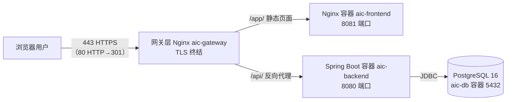

# AI 智能获客助手 · 部署文档

> 适用版本：M1 骨架与授权（可部署、可激活、可登录）
> 部署方式：Docker Compose 一键部署（PostgreSQL 内置）

---

## 一、架构总览



- **网关层**：本地默认纯 HTTP（80）；服务器用 `docker-compose.prod.yml` 覆盖启用 HTTPS（443 终结 TLS，80 → 301 跳转），证书为腾讯云 SSL 证书
- **后端**：Spring Boot 4.1.0（Java 21），Flyway 自动建表迁移
- **数据库**：PostgreSQL 16，数据卷 `db_data` 持久化

---

## 二、前置要求

| 项目     | 要求                                                                  |
| :------- | :-------------------------------------------------------------------- |
| 操作系统 | Linux / macOS / Windows（Docker Desktop）                             |
| Docker   | 20.10+，含 Docker Compose v2 插件                                     |
| 可用端口 | `80`、`8080`（后端）、`5432`（数据库）；服务器启用 HTTPS 需额外 `443` |
| 网络     | 可访问 Docker Hub 与模型 API（如 `api.deepseek.com`）                 |

> 说明：本地开发保持纯 HTTP 即可；服务器 HTTPS（腾讯云证书）配置见 FAQ 8。

---

## 三、一键部署步骤

### 1. 拉取代码

```bash
git clone https://github.com/yuezu1026/ai-customer.git
cd ai-customer
```

### 2. 准备环境变量

```bash
cp .env.example .env
```

编辑 `.env`，**生产环境至少修改以下 3 项**：

```ini
# ① 数据库密码（必改）
DB_PASSWORD=替换为强密码

# ② JWT 签名密钥，至少 32 字节随机串（必改）
JWT_SECRET=$(openssl rand -base64 48)

# ③ 敏感配置加密密钥，必须恰好 32 字节（必改）
CONFIG_ENC_KEY=替换为恰好32字符的随机串

# ④ AI 模型配置（可先在系统设置页配置，二选一）
AI_API_KEY=
AI_BASE_URL=https://api.deepseek.com
AI_MODEL=deepseek-chat
```

> `AI_API_KEY` 留空也可以在部署后登录「系统设置」页填写，二者等价（保存后加密落库）。

### 3. 启动

```bash
docker compose up -d --build
```

首次启动会构建镜像并等待数据库健康检查通过（约 1-3 分钟）。查看状态：

```bash
docker compose ps
# 期望 3 个容器均为 running/healthy
```

### 4. 验证

| 检查项       | 命令 / 地址                                               |
| :----------- | :-------------------------------------------------------- |
| 前端页面     | http://localhost/ （应跳转激活页）                        |
| 后端健康检查 | http://localhost:8080/health （应返回 `{"status":"UP"}`） |
| 后端日志     | `docker compose logs -f backend`                          |
| 数据库迁移   | 日志出现 `Successfully validated 18 migrations` 即成功    |

---

## 四、首次使用流程（验收路径）

1. **激活 License**：浏览器打开首页 → 输入激活码 → 激活成功显示到期时间
   - 激活码由管理员通过后端接口生成（见下文「五、激活码管理」）
   - 未激活时核心 API 不可用，仅能访问激活页
2. **登录**：使用默认账号 `admin` / `Admin@123456`（**登录后请立即修改密码**）
3. **配置 AI**：进入「系统设置」→ 填写 AI API Key / Base URL / 模型名 → 保存
4. **调用验证**：回到「工作台」→ 填写客户信息 → 「AI 生成邮件」→ 查看生成结果
5. **核对用量**：工作台「AI 用量统计」卡片应实时更新调用次数与 Token
6. **客户管理（M2-1 CRM）**：进入「客户管理」→ 新增/编辑/删除客户、状态打标（新线索→已触达→有意向→已转化/无效）→ 搜索/筛选/翻页 → 导出 CSV（Excel 可直接打开）→ 导入 CSV（自动跳表头、重复客户判重）
   - 客户列表点「✉ 邮件」可用该客户信息一键生成 AI 邮件
   - 工作台「客户概览」卡片实时显示客户总数与各状态分布

---

## 五、激活码管理（厂商 / 管理员）

> M4 起激活码改为**厂商离线签名签发**：使用独立工具 `license-tool` 生成（Ed25519 私钥签名），
> 客户系统内置公钥验签，无需连接客户数据库。旧版「登录后调接口生成」已移除。

### 1. 生成密钥对（厂商首次一次性）

```bash
cd license-tool
java LicenseTool.java keygen -o ./keys
# 生成 keys/license-private.pem（厂商保存，切勿外泄）与 keys/license-public.pem
```

公钥 `license-public.pem` 需放置到后端 `src/main/resources/license-public.key` 后重新构建镜像。

### 2. 签发激活码（厂商本地，离线）

```bash
cd license-tool
java LicenseTool.java gen --private ./keys/license-private.pem \
    --edition pro --customer "XX公司" --serial S20260809001 --days 365
```

参数说明：

- `--edition`：basic / pro / enterprise
- `--customer`：客户名（不能包含 `|`）
- `--serial`：唯一序列号（建议格式 `S+日期+序号`，如 S20260809001）
- `--days`：有效期天数

输出激活码示例（复制给客户，粘贴到系统激活页）：

```
AICP-GSSRSN5WCET52EKQ82W52GBJ82SRTU67RVNCXDZ6RCAYFFEDX4RTCZ3L82T5EE3S82WRSEKJ8AVM2G3J96-NMKGLB86ABEV8MACV39K3K9GS4SU2JK74FV5PTUZFSTCAHXCK3HL2HR2M348N8BU5A2WCAVPEA7YR32X64WTKCK8YBR8N2HTQXP8C42
```

### 3. 本地验签（调试）

```bash
java LicenseTool.java verify --public ./keys/license-public.pem <激活码>
```

### 4. 激活码规则（M4 签名版）

- 格式：`AIC{版别}-{payloadBase32}-{signatureBase32}`（版别 B/P/E）
- payload 内含：版别 / 唯一序列号 / 客户名 / 签发日期 / 到期日期
- 无私钥无法伪造，改任意字符验签即失败
- **序列号防重复使用**：同一激活码激活后绑定设备指纹，换设备再激活被拒
- **运行期指纹校验**：每次核心接口调用比对当前设备指纹，换 MAC / 换服务器立刻失效
- **续期 / 重激活**：同设备粘贴新激活码即可覆盖续期（未过期可续签，过期后可重激活）

---

## 六、日常运维

### 查看日志

```bash
docker compose logs -f backend    # 后端
docker compose logs -f frontend   # 前端
docker compose logs -f db         # 数据库
```

后端生产日志同时落盘（容器内 `logs/ai-customer.log`，20MB×30 轮滚动）。

### 备份与恢复

```bash
# 备份（导出 SQL 到宿主机）
docker compose exec db pg_dump -U ai_customer ai_customer > backup_$(date +%F).sql

# 恢复
cat backup_2026-08-08.sql | docker compose exec -T db psql -U ai_customer ai_customer
```

> 备份文件含 License 激活记录与用量数据，请妥善保管。

### 升级版本

```bash
git pull
docker compose up -d --build --remove-orphans
```

Flyway 会自动执行新增迁移脚本（V2、V3、V4…V18），无需手工操作。

### 停止 / 清理

```bash
docker compose down          # 停止（保留数据卷）
docker compose down -v       # 停止并删除数据库数据（⚠️ 不可恢复）
```

---

## 七、常见问题（FAQ）

### 1. 前端能打开，但提示"未激活"

首次部署未激活属正常。用管理员接口生成激活码后在激活页输入即可。

### 2. AI 生成报"请先在系统设置中配置 AI API Key"

`AI_API_KEY` 环境变量与系统设置页的 Key 均为空。两种方式任选其一填写，保存即生效（无需重启）。

### 3. AI 生成报 401 / "AI 调用失败"

- API Key 错误或额度不足：在 DeepSeek 开放平台检查
- 网络不通：确认服务器可访问 `api.deepseek.com`（或自定义 `AI_BASE_URL` 对应的内网地址）

### 4. 端口冲突（80 / 8080 / 5432 被占用）

修改 `docker-compose.yml` 的 `ports` 映射（如 `"8081:8080"`），改后 `docker compose up -d` 重建容器。

### 5. 数据库连接失败 / backend 反复重启

数据库健康检查未通过（首次启动下载镜像慢）。查看 `docker compose ps`，等 db 变 healthy 后 backend 会自动启动；若持续失败执行 `docker compose up -d` 重试。

### 6. 忘记 admin 密码

进入后端容器，用 jshell/psql 重置（BCrypt 哈希）：

```bash
docker compose exec db psql -U ai_customer ai_customer \
  -c "UPDATE users SET password_hash = '<新的BCrypt哈希>' WHERE username = 'admin';"
```

可在任意机器用 `htpasswd -bnBC 10 "" 新密码` 生成 BCrypt 哈希。

### 7. 激活码过期 / 换机器被拒

- License 到期：联系管理员生成新激活码
- 换设备：License 绑定硬件指纹，激活其他机器需管理员将原记录置为 inactive 后重新激活

### 8. 需要 HTTPS（服务器部署）

本地默认纯 HTTP（`docker-compose.yml`）。服务器启用 HTTPS 使用腾讯云 SSL 证书，**在生产服务器（43.153.229.106）由宿主机 nginx 直接终结 TLS**（`/etc/nginx/sites-enabled/sales-agent`），已上线。

**① 腾讯云申请证书**

- SSL 证书控制台 → 申请免费证书（域名 `sales-agent.top`）→ 签发后**下载 → 选「Nginx」格式**
- 解压得到 `xxx_bundle.pem`（证书链）与 `xxx.key`（私钥）
- 免费证书有效期 90 天，到期需在腾讯云重新申请，再重复步骤 ②③

**② 安装证书 + 部署（宿主机 nginx 方案，服务器已执行）**

```bash
# 上传证书包到服务器 /tmp/certs/（本地：scp certs/* ubuntu@<ip>:/tmp/certs/）
# 安装证书
sudo mkdir -p /etc/nginx/certs
sudo cp /tmp/certs/fullchain.pem /etc/nginx/certs/fullchain.pem   # chmod 644
sudo cp /tmp/certs/privkey.pem /etc/nginx/certs/privkey.pem       # chmod 600

# 替换站点配置（本仓库 gateway/nginx.server-ssl.conf，nginx 1.24 兼容）
sudo cp gateway/nginx.server-ssl.conf /etc/nginx/sites-enabled/sales-agent
sudo nginx -t && sudo nginx -s reload
```

> 服务器实际架构：80/443 由**宿主机系统 nginx**（1.24.0）监听，代理到容器 8081/8080；容器内无 gateway 服务。因此 HTTPS 直接在宿主机 nginx 上配置（`gateway/nginx.server-ssl.conf`），而非 docker gateway。
> 若服务器改为 docker compose 部署（含 gateway 服务），则用 `gateway/nginx.ssl.conf` + `docker-compose.prod.yml` 覆盖方案（见仓库注释）。

**③ 验证**

```bash
curl -I https://sales-agent.top/app/   # 期望 200（无证书告警）
curl -I http://sales-agent.top/        # 期望 301 → https://
```

**说明：**

- 证书私钥位于 `certs/`（已被 .gitignore 排除，严禁入库），服务器副本在 `/etc/nginx/certs/privkey.pem`（chmod 600）
- HTTPS 配置在 `gateway/nginx.server-ssl.conf`（80 → 301 跳转 + 443 TLS 终结，`listen 443 ssl http2` 兼容 nginx 1.24），`server_name` 为 `sales-agent.top`
- 换证书（90 天到期）：腾讯云重新签发下载 → 替换 `/etc/nginx/certs/` 两个文件 → `sudo nginx -s reload` 即可生效
- 本地开发始终执行 `docker compose up -d --build`（纯 80，无需证书）

### 9. 如何确认当前 License 状态

```bash
curl -s http://localhost:8080/api/license | head
# 或登录后访问前端激活页查看剩余天数
```

### 10. 日志文件在哪

后端容器内 `logs/ai-customer.log`；宿主机查看：

```bash
docker compose exec backend tail -f logs/ai-customer.log
```

---

## 八、开发环境（可选）

本地开发不依赖 Docker Compose 的镜像构建，只需数据库容器：

```bash
# 仅启动数据库
docker compose up -d db

# 后端（Java 21 + Maven）
cd backend && mvn spring-boot:run

# 前端（Node 22）
cd frontend && npm install && npm run dev
```

前端 dev server（5173）已配置 `/api` 代理到 `localhost:8080`。
