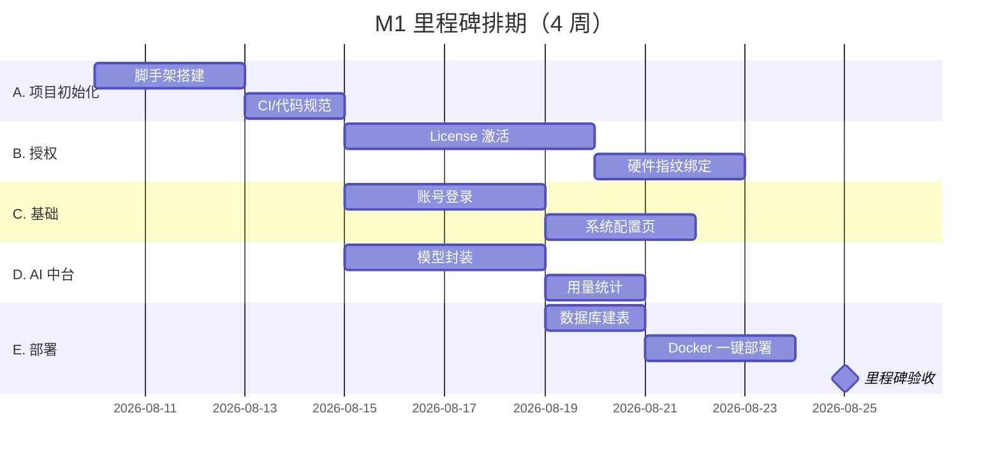

# M1 里程碑任务清单（骨架与授权）

> 对齐《MVP 核心功能规划》第四章 M1：项目骨架 + License 激活 + 账号登录 + AI 能力中台最小版
> 周期：第 1 个月　验收标准：**可部署、可激活、可登录**

## 一、任务总览

## 二、任务分解（Todo 颗粒度）

### A. 项目初始化（4-5 天）

| #     | 任务                                                              | 产出物             | 依赖   | 预计 |
| :---- | :---------------------------------------------------------------- | :----------------- | :----- | :--- |
| ✅ A1 | 初始化 Git 仓库 + .gitignore（排除 .env、target/、node_modules/） | 仓库可用           | -      | 0.5d |
| ✅ A2 | 后端脚手架：Spring Boot 4.1.0 + Spring AI 2.0.0 多模块结构        | `backend/` 可编译  | -      | 1d   |
| ✅ A3 | 前端脚手架：Vite + React + 基础路由与布局                         | `frontend/` 可运行 | -      | 1d   |
| ✅ A4 | 前后端联调打通：/api/health 健康检查 + 登录页调用                 | 联调成功           | A2, A3 | 0.5d |
| ✅ A5 | Dockerfile 后端 + 前端 nginx + docker-compose.yml                 | 本地一键启动       | A4     | 1d   |
| ✅ A6 | 统一异常处理、统一响应体 `{code, message, data}`                  | 后端规范落地       | A2     | 0.5d |

**✅ A 完成标准**：`docker compose up` 启动前后端，浏览器可访问登录页。

### B. License 授权（8 天）

| #     | 任务                                                        | 产出物       | 依赖   | 预计 |
| :---- | :---------------------------------------------------------- | :----------- | :----- | :--- |
| ✅ B1 | License 数据表 + 实体 + 迁移（见 db-design.md §2.2）        | 表就绪       | A2     | 0.5d |
| ✅ B2 | 激活码生成器（服务端工具，含签名/校验位）                   | 可生成激活码 | -      | 1d   |
| ✅ B3 | 激活接口：POST /api/license/activate（校验格式 + 记录状态） | 接口可用     | B1, B2 | 1d   |
| ✅ B4 | License 状态查询：GET /api/license（剩余天数/版本/状态）    | 接口可用     | B3     | 0.5d |
| ✅ B5 | 硬件指纹采集（CPU/主板/磁盘序列号 → SHA-256）               | 指纹工具类   | -      | 1d   |
| ✅ B6 | 指纹绑定与校验（未激活拦截核心 API，防一码多用）            | 绑定逻辑     | B3, B5 | 1.5d |
| ✅ B7 | 启动时 License 检查拦截器（无效/过期 → 引导激活页）         | 全局拦截     | B6     | 1d   |
| ✅ B8 | 前端激活页（输入激活码 → 显示激活结果/到期时间）            | 页面可用     | B4, B7 | 1.5d |

**✅ B 完成标准**：未激活只能访问激活页；激活后核心 API 可用；换设备激活被拒。

### C. 账号登录与系统配置（7 天）

| #     | 任务                                                       | 产出物   | 依赖 | 预计 |
| :---- | :--------------------------------------------------------- | :------- | :--- | :--- |
| ✅ C1 | users 表 + 初始化 admin 账号（BCrypt）                     | 表就绪   | A2   | 0.5d |
| ✅ C2 | 登录接口：POST /api/auth/login（JWT 签发）                 | 接口可用 | C1   | 1d   |
| ✅ C3 | JWT 校验拦截器 + 当前用户上下文                            | 鉴权落地 | C2   | 1d   |
| ✅ C4 | 修改密码接口                                               | 接口可用 | C3   | 0.5d |
| ✅ C5 | 登录页 + 路由守卫 + Token 持久化                           | 页面可用 | C2   | 1.5d |
| ✅ C6 | system_config 表 + 配置 CRUD 接口（见 db-design.md §2.13） | 接口可用 | A2   | 1d   |
| ✅ C7 | 系统配置页（AI Key / SMTP / 数据源，敏感项加密存储）       | 页面可用 | C6   | 1.5d |

**✅ C 完成标准**：登录后进入工作台；配置页可保存 AI/SMTP 配置并加密落库。

### D. AI 能力中台最小版（6 天）

| #     | 任务                                                                | 产出物     | 依赖 | 预计 |
| :---- | :------------------------------------------------------------------ | :--------- | :--- | :--- |
| ✅ D1 | Spring AI 接入（@ConditionalOnProperty 选择 deepseek/qwen）         | 模型可调用 | A2   | 1d   |
| ✅ D2 | 统一 AI 服务接口（chat / generate）封装                             | 服务层就绪 | D1   | 1d   |
| ✅ D3 | Prompt 模板管理（prompt_template 表 + CRUD，见 db-design.md §2.12） | 接口可用   | D1   | 1d   |
| ✅ D4 | Token 用量记录（ai_usage_log 表，每次调用落库）                     | 用量入库   | D2   | 1.5d |
| ✅ D5 | 简单限流（按用户/场景，防 API 超限）                                | 限流生效   | D4   | 1d   |
| ✅ D6 | 用量查询接口 + 前端用量看板（token/成本/调用次数）                  | 看板可用   | D4   | 0.5d |

**✅ D 完成标准**：用配置页的 Key 调用一次模型生成，用量实时入库并在看板可见。

### E. 部署与验收（5 天）

| #     | 任务                                                | 产出物   | 依赖  | 预计 |
| :---- | :-------------------------------------------------- | :------- | :---- | :--- |
| ✅ E1 | 生产环境配置分离（application-prod.yml + .env）     | 配置就绪 | A5    | 0.5d |
| ✅ E2 | 数据库迁移脚本（Flyway 初始化 SQL）                 | 迁移可用 | A2    | 1d   |
| ✅ E3 | 部署文档 + 视频教程（含常见问题）                   | 文档产出 | E1    | 1.5d |
| ✅ E4 | 端到端验收测试（部署 → 激活 → 登录 → 配置 → 调 AI） | 验收通过 | E1-E3 | 1d   |
| ⬜ E5 | 种子用户试用邀请（首批 3-5 家）                     | 反馈收集 | E4    | 1d   |

**✅ M1 完成标准**：全新机器 Docker 一键部署 → 激活 License → 登录 → 配置 AI Key → 成功调用一次 AI 生成。

## 三、M1 期间的关键决策点

| 决策点   | 选项                 | 建议                            | 理由                                         |
| :------- | :------------------- | :------------------------------ | :------------------------------------------- |
| 数据库   | SQLite vs PostgreSQL | **PostgreSQL + Docker 内置**    | 避免迁移成本，Docker 部署零额外负担          |
| AI 模型  | DeepSeek vs Qwen     | **DeepSeek（OpenAI 兼容协议）** | 成本低、API 兼容 Spring AI 的 openai starter |
| 认证方案 | JWT vs Session       | **JWT**                         | 前后端分离天然适配，无状态易扩展             |
| 前端语言 | TS vs JS             | **TypeScript**                  | 一人项目靠类型减少低级错误                   |
| 指纹采集 | 后端采集 vs 前端采集 | **后端采集**                    | 安全可控，前端只上报哈希结果                 |
