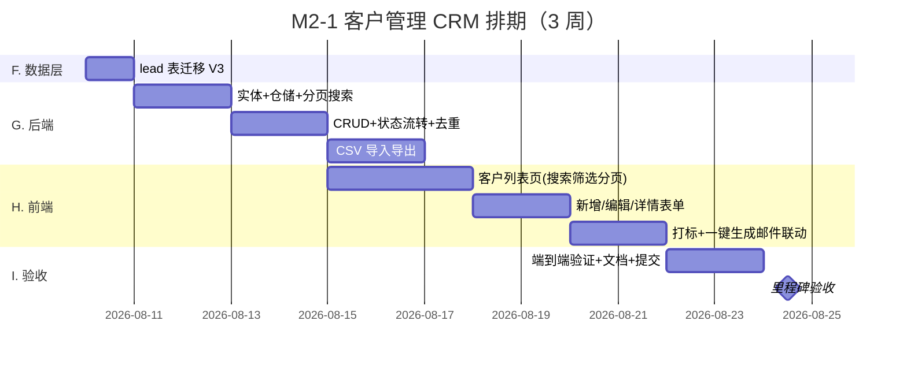

# M2 里程碑任务清单（潜客闭环 · 第一步：客户管理 CRM）

> 对齐《MVP 核心功能规划》第二章 2.1 与第四章 M2：潜客挖掘
> M2 分三步：**第一步 客户管理 CRM（本清单）** → 第二步 数据源对接（Function Calling）→ 第三步 RAG 客户画像
> 周期：第 1.5~2 个月　验收标准：**V1 潜客闭环跑通（人工录入/导入 → 列表管理 → 打标 → 导出 → 一键生成邮件）**

---

## 〇、为什么先做 CRM 而不是数据源对接

| 对比项     | 先做 CRM（本清单）                    | 先做数据源对接                      |
| :--------- | :------------------------------------ | :---------------------------------- |
| 价值验证   | 立即成为"客户管理系统"，可日常使用    | 依赖外部 API 稳定性/合规授权        |
| 技术风险   | 低（纯 CRUD + 现有 AI 服务）          | 中（Function Calling + 数据源 SDK） |
| 数据来源   | 人工录入 + CSV 导入，随时可用         | 需先接通 1 家数据源                 |
| 为后续铺路 | lead 表是挖掘结果的落点，先建表无返工 | 挖掘出的数据仍需 CRM 承接           |

**结论**：CRM 是系统的"底座"，数据源挖掘的结果最终都汇入 lead 表。先做 CRM 可立即交付可用的客户管理能力，再叠加自动化挖掘。

---

## 一、任务总览



## 二、任务分解（Todo 颗粒度）

### F. 数据层（1 天）

| #     | 任务                                             | 产出物         | 依赖 | 预计 |
| :---- | :----------------------------------------------- | :------------- | :--- | :--- |
| ✅ F1 | lead 表迁移 V3（对齐 db-design.md §2.5，含索引） | V3\_\_lead.sql | -    | 1d   |

**F 完成标准**：启动后 Flyway 自动建表；`idx_lead_status / idx_lead_email / uk_lead_source` 生效。

### G. 后端（6 天）

| #     | 任务                                                                | 产出物               | 依赖 | 预计 |
| :---- | :------------------------------------------------------------------ | :------------------- | :--- | :--- |
| ✅ G1 | Lead 实体 + Repository（JPA，分页/搜索/筛选）                       | Lead.java / LeadRepo | F1   | 2d   |
| ✅ G2 | LeadService + LeadController CRUD（增删改查 + 状态流转 + 去重校验） | 接口可用             | G1   | 2d   |
| ✅ G3 | CSV 导入（模板下载 + 解析校验 + 去重）+ CSV 导出                    | 导入/导出可用        | G2   | 2d   |

**接口草案**：

```
GET    /api/leads?page=&size=&keyword=&status=&industry=&sourceType=   分页+搜索+筛选
POST   /api/leads                    新增（company_name 必填，uk_lead_source 去重）
PUT    /api/leads/{id}               编辑
DELETE /api/leads/{id}               删除
PUT    /api/leads/{id}/status        状态流转：new→contacted→interested→converted/invalid
GET    /api/leads/export.csv         按当前筛选条件导出 CSV
POST   /api/leads/import             上传 CSV 导入（返回成功/失败条数）
GET    /api/leads/stats              状态分布统计（供看板）
```

**G 完成标准**：curl 实测增删改查 + 状态流转 + 分页搜索 + 去重（重复 source 拒绝）；导入导出闭环。

### H. 前端（7 天）

| #     | 任务                                                                   | 产出物        | 依赖 | 预计 |
| :---- | :--------------------------------------------------------------------- | :------------ | :--- | :--- |
| ✅ H1 | 客户列表页（表格 + 搜索 + 状态/行业筛选 + 分页）                       | Customers.tsx | G2   | 3d   |
| ✅ H2 | 新增/编辑表单（含校验、必填提示；详情以弹窗内备注呈现）                | 表单可用      | H1   | 2d   |
| ✅ H3 | 状态打标（下拉流转）+ 一键"AI 生成邮件"（复用 /api/ai/generate/email） | 联动可用      | H2   | 2d   |
| ✅ H4 | 导航加入口 + 工作台看板加客户统计卡片（总客户/各状态数）               | 入口与统计    | H1   | 1d   |

**H 完成标准**：浏览器实测——新增客户 → 列表出现 → 搜索/筛选/翻页正常 → 改状态 → 一键生成邮件成功 → 导出 CSV 可打开。

### I. 验收与收尾（3 天）

| #     | 任务                                                   | 产出物    | 依赖  | 预计 |
| :---- | :----------------------------------------------------- | :-------- | :---- | :--- |
| ✅ I1 | 端到端验收（新增→管理→打标→生成邮件→导出全链路）       | 验收通过  | H1-H4 | 2d   |
| ✅ I2 | 文档更新（deploy.md 功能清单 + m2 勾选）+ Git 提交推送 | 文档+提交 | I1    | 1d   |

**✅ M2-1 完成标准**：全新机器部署后，人工录入/导入客户 → 列表管理 → 打标 → 一键生成邮件 → 导出 CSV，全链路可用。

## 三、与 AI 生成联动的设计（关键决策）

- **现状**：Dashboard 工作台表单（公司/行业/联系人/目标）→ `/api/ai/generate/email`
- **M2-1 方案**：客户列表点"生成邮件"→ 用该客户行的 companyName/industry/contactName 预填 + goal 手动输入 → 调同一接口 → 结果可编辑
- **M2-1.5 更新**（跟进记录 + 邮件草稿保存，2026-08-08）：生成结果可**保存为邮件草稿**（落库 email_draft，status=draft），并可人工确认（status=confirmed）；SMTP 发送与追踪仍留 M3
- **理由**：用户要求先行沉淀跟进记录与邮件内容；发送/追踪留 M3 邮件闭环，一次做完"确认→发送→追踪"

---

## 三·五、M2-1.5 客户跟进与邮件草稿保存（2026-08-08 新增）

> 用户追加需求：增加对客户的**跟踪记录**和**邮件内容的保存记录管理**。
> 范围：跟进记录管理 + AI 邮件内容保存（email_draft 落库），**不含 SMTP 发送/追踪**（留 M3）。

### 任务清单

| #     | 任务                                                            | 产出物                          | 依赖 | 状态 |
| :---- | :-------------------------------------------------------------- | :------------------------------ | :--- | :--- |
| ✅ J1 | V4 迁移：follow_up + email_draft 表（对齐 db-design §2.6/§2.9） | V4\_\_follow_up_email_draft.sql | -    | 完成 |
| ✅ J2 | FollowUp / EmailDraft 实体 + Repository                         | 实体 + 仓储                     | J1   | 完成 |
| ✅ J3 | FollowUpService/EmailDraftService + 子资源 Controller           | 接口可用                        | J2   | 完成 |
| ✅ J4 | 前端：客户行"跟进"按钮 + 详情弹窗（跟进增删 + 草稿确认/删除）   | Customers.tsx                   | J3   | 完成 |
| ✅ J5 | 前端：生成邮件可保存为草稿（主题+正文）                         | 保存按钮                        | J4   | 完成 |
| ✅ J6 | E2E：增删/确认/校验分支 + DOM 测量 + 文档 + Git 提交            | 验收通过                        | J5   | 完成 |

**接口清单**：

```
GET    /api/leads/{leadId}/follow-ups              跟进记录列表（happened_at 倒序）
POST   /api/leads/{leadId}/follow-ups              新增跟进（content 必填，method 默认 other）
PUT    /api/leads/{leadId}/follow-ups/{id}         编辑跟进
DELETE /api/leads/{leadId}/follow-ups/{id}         删除跟进
GET    /api/leads/{leadId}/email-drafts            邮件草稿列表（created_at 倒序）
POST   /api/leads/{leadId}/email-drafts            保存草稿（subject/body 必填，tone 默认 neutral）
PUT    /api/leads/{leadId}/email-drafts/{id}       编辑草稿
PUT    /api/leads/{leadId}/email-drafts/{id}/status 状态流转 draft ↔ confirmed
DELETE /api/leads/{leadId}/email-drafts/{id}       删除草稿
```

**J 完成标准**：浏览器实测——跟进新增→列表→删除闭环；AI 生成邮件→保存草稿→详情弹窗可见→确认/删除闭环；空值/不存在校验分支报错正常；弹窗无溢出无重叠。

## 三·六、M2-1.6 收件箱：MCP 抓取客户回复邮件（2026-08-08 新增）

> 用户原话："能否应用 MCP 去邮箱抓取到客户的恢复（回复）邮件？也进行管理？"
> 需求拍板：**MCP Server 方案**（本服务自建 MCP Server 暴露 /mcp，EmailMcpClient 自连抓取），管理功能全选：
> 收件箱 / 关联 lead / 转跟进 / AI 回复草稿。
> 配置驱动双模式：`app.email.provider=mock`（内置模拟邮件，无邮箱可验证全链路）/ `imap`（Jakarta Mail 读真实邮箱）。

### 任务清单

| #     | 任务                                                                                                                  | 产出物                | 依赖 | 状态 |
| :---- | :-------------------------------------------------------------------------------------------------------------------- | :-------------------- | :--- | :--- |
| ✅ K1 | V5 迁移：email_inbox 表（对齐 db-design §2.15）                                                                       | V5\_\_email_inbox.sql | -    | 完成 |
| ✅ K2 | EmailInbox 实体 + Repository（Specification 动态检索）                                                                | 实体 + 仓储           | K1   | 完成 |
| ✅ K3 | MCP Server：@McpTool email_list_emails / email_read_email / email_mark_read + EmailMailboxService（imap/mock 双实现） | EmailMcpTools.java 等 | -    | 完成 |
| ✅ K4 | EmailMcpClient（Streamable HTTP 自连 /mcp）+ EmailInboxService（同步/去重/关联 lead/转跟进/AI 分析）                  | 服务层                | K3   | 完成 |
| ✅ K5 | EmailInboxController（/api/emails/inbox CRUD + sync + analyze）                                                       | 接口可用              | K4   | 完成 |
| ✅ K6 | 前端收件箱页：列表/搜索/只看未读/同步/详情/已读切换/转跟进/AI 分析弹窗/删除                                           | Inbox.tsx + 路由导航  | K5   | 完成 |
| ✅ K7 | @Scheduled 定时同步（app.email.sync-cron，默认每 5 分钟）                                                             | 调度任务              | K4   | 完成 |
| ✅ K8 | E2E：接口全链路 + DOM 测量 + 文档 + Git 提交                                                                          | 验收通过              | K6   | 完成 |

**接口清单**：

```
GET    /api/emails/inbox?keyword=&unreadOnly=&leadId=&page=&size=   收件箱分页列表（关键词/未读/客户过滤）
GET    /api/emails/inbox/{id}                                       邮件详情（含正文、关联客户）
POST   /api/emails/inbox/sync                                       手动触发 MCP 同步（返回新增/累计数）
PUT    /api/emails/inbox/{id}/read   {"read":true|false}            标记已读/未读（同步邮箱端）
POST   /api/emails/inbox/{id}/convert-follow-up  {"method":"phone"}  一键转跟进记录（需已关联客户）
POST   /api/emails/inbox/{id}/analyze                                AI 意图分析 + 回复建议（回写 ai_* 字段）
DELETE /api/emails/inbox/{id}                                       删除邮件（仅本地，下次同步会重新抓回）
```

**MCP 工具**（本服务 /mcp，Streamable HTTP）：

```
email_list_emails(folder="INBOX", limit, unread_only, since) → 邮件列表
email_read_email(uid)                                            → 单封完整正文
email_mark_read(uid, is_read)                                    → 标记已读状态
```

**K 完成标准**：接口全链路实测（sync 去重、列表/详情/已读/转跟进/analyze 错误分支/删除）；无 AI key 时 analyze 返回 400"请先在系统设置中配置 AI API Key"；未关联客户转跟进 400；前端 DOM 测量无溢出无重叠；文档同步更新并 Git 提交。

**已知约束**：删除仅删本地记录，mock 模式内存状态重启复位；真实 IMAP 需配置 app.email.imap.\* 环境变量。

## 三·七、M2-1.7 AI 生成邮件基于沟通记录（2026-08-08 新增）

> 用户需求："AI 生成邮件"要根据与该客户的沟通记录生成新邮件内容。
> 技术选型结论：**不需要 RAG / ChatMemory** —— 单客户沟通记录量小且结构化，
> 直接把"跟进记录 + 已发邮件 + 客户回复"拼成时间线注入 Prompt 即实现"业务数据即记忆"。
> 真正的 RAG（客户画像向量检索）留待 M2-3。

### 任务清单

| #     | 任务                                                                                       | 产出物        | 依赖 | 状态 |
| :---- | :----------------------------------------------------------------------------------------- | :------------ | :--- | :--- |
| ✅ L1 | Repository 增时间线查询：跟进正序 / 已确认草稿正序 / 客户回复正序                          | 3 个查询方法  | -    | 完成 |
| ✅ L2 | EmailDraftService.generateWithContext：聚合时间线 → 拼接 Prompt → 解析"主题/正文"          | 服务方法      | L1   | 完成 |
| ✅ L3 | 接口 POST /api/leads/{leadId}/email-drafts/generate（goal 必填，tone 可选）                | 接口可用      | L2   | 完成 |
| ✅ L4 | 前端：生成按钮改调新接口，弹窗提示"已结合沟通记录"，自动填充主题+正文                      | Customers.tsx | L3   | 完成 |
| ✅ L5 | 验证：空目标 400 / 无 AI key 400 / 客户不存在 404 / 时间线三表查询 / DOM 测量 + 文档 + Git | 验收通过      | L4   | 完成 |

**接口清单**：

```
POST /api/leads/{leadId}/email-drafts/generate
  body: {"goal":"推进方案评审，约下周线上沟通", "tone":"neutral"}
  返回: {"subject":"...","body":"..."}
```

**Prompt 设计要点**：system 要求"必须引用沟通记录中的关键事实，让客户感到你记得我们聊过什么"；输出固定 `主题：…\n正文：…` 两行格式，服务端解析回填表单。

**L 完成标准**：接口链路实测（空目标校验、无 key 业务 400、客户不存在 404、时间线聚合三表 SQL 执行）；前端 DOM 测量 modal 无溢出无重叠；文档更新 + Git 提交。

**已知约束**：真实生成需在系统设置配置 AI API Key；无 key 时返回 400 业务提示（非 401）。

### M2-1.7 补充：全局邮件草稿管理页（2026-08-08）

> 用户需求："生成后的邮件草稿，在哪里管理？"——原草稿仅挂在客户详情弹窗（按客户维度），
> 补充**跨客户统一管理页**（导航新增「草稿箱」，/drafts）。

**后端**：

```
GET /api/email-drafts?keyword=&status=&page=&size=
  返回 Page<{id, leadId, leadCompanyName, leadContactName, subject, body, tone, status, createdAt, confirmedAt}>
  keyword 模糊匹配主题/正文；status=draft|confirmed；created_at 倒序
```

- EmailDraftRepository 继承 JpaSpecificationExecutor（动态拼接，规避 Hibernate NULL 参数 bytea 坑）
- EmailDraftService.listAll：Specification 检索 + lead 批量查 → 视图对象

**前端**：`frontend/src/pages/Drafts.tsx`（路由 /drafts + Nav 链接）

- 表格：客户（可点击跳客户管理）/ 主题 / 状态 / 保存时间 / 操作（✓ 确认、删除）
- 行点击展开正文（语气 + 确认时间 + 全文）
- 状态筛选（全部/草稿/已确认）+ 关键词搜索 + 分页
- 确认/改回/删除复用既有 `/api/leads/{leadId}/email-drafts` 接口

**E2E 验证**：列表展示 / 展开正文 / 确认↔改回闭环（含确认时间）/ 筛选与搜索（命中与空）/ 删除（confirm 取消与确认）/ 客户跳转 / DOM 测量零溢出零重叠。

## 三·八、M2-1.8 微信沟通工作台（2026-08-09 新增）

> 用户需求："在系统中添加客户微信、在系统中沟通"。
> 方案决策：**先 A 后 B** —— 一期做记录式工作台（零外部依赖、零封号风险），
> 二期对接企业微信 API 真实收发（需企业微信认证 + 公网回调，工作量数倍）。
> 个人微信无官方 API，第三方 hook 有封号风险，不作为正式功能。

### 任务清单

| #     | 任务                                                                                                     | 产出物            | 依赖 | 状态   |
| :---- | :------------------------------------------------------------------------------------------------------- | :---------------- | :--- | :----- |
| ✅ W1 | V11 迁移：lead 加 wechat_id/wechat_name + wechat_message 表（direction/content/ai_reply/status/sent_at） | V11\_\_wechat.sql | -    | 完成   |
| ✅ W2 | 实体/仓储：WechatMessage + Lead 加微信字段；LeadService 编辑与搜索支持微信号                             | 后端              | W1   | 完成   |
| ✅ W3 | WechatMessageService：CRUD + AI 生成回复建议（客户画像+微信时间线→Prompt，不落库）                       | 服务方法          | W2   | 完成   |
| ✅ W4 | 接口：GET/POST/PUT/DELETE /api/leads/{leadId}/wechat-messages + POST .../suggest                         | 接口可用          | W3   | 完成   |
| ✅ W5 | 前端：客户列表微信列 + 编辑表单微信号 + 💬 微信会话弹窗（气泡/AI 生成/记录/删除）                        | Customers.tsx     | W4   | 完成   |
| ✅ W6 | 验证：接口链路（增删改查/方向校验/空内容 400/客户 404）+ E2E DOM 测量 + 文档 + Git                        | 验收通过           | W5   | 完成 |

**接口清单**：

```
GET    /api/leads/{leadId}/wechat-messages           # 会话消息（sent_at 正序）
POST   /api/leads/{leadId}/wechat-messages           # 记录消息 {direction:"in"|"out", content, aiReply?}
POST   /api/leads/{leadId}/wechat-messages/suggest   # AI 生成回复 {goal?, tone?} → {reply}
PUT    /api/leads/{leadId}/wechat-messages/{id}      # 编辑内容/时间
DELETE /api/leads/{leadId}/wechat-messages/{id}      # 删除
```

**设计要点**：

- 人机协同红线不变：AI 只生成回复建议（suggest 不落库），人工确认后以 out 消息落库；带 aiReply 的 out 消息 status=ai_confirmed（气泡显示 🤖）
- AI 上下文：客户画像 + 微信消息时间线 + follow_up 中 method=wechat 的跟进记录（业务数据即记忆）
- 二期企业微信对接：仅替换收发通道，direction/content 结构不变

## 四、后续 M2 步骤（本清单不包含，占位预告）

| 步骤 | 内容                                                                                              | 依赖 lead 表                                  | 预计   |
| :--- | :------------------------------------------------------------------------------------------------ | :-------------------------------------------- | :----- |
| M2-2 | 数据源对接：data_source 表 + Function Calling 调 1 家合规 API 挖掘 → 写入 lead（source_type=api） | ✅ 已完成（2026-08-09，见 doc/m2-2-tasks.md） | 2 周   |
| M2-3 | RAG 客户画像：customer_profile 表 + CSV 导入向量化 + 检索打分（profile_score）                    | ✅ 已完成（2026-08-09，见 doc/m2-3-tasks.md） | 1.5 周 |

## 五、M2-1 关键决策点

| 决策点       | 选项               | 建议                                                            | 理由                                       |
| :----------- | :----------------- | :-------------------------------------------------------------- | :----------------------------------------- |
| lead 表位置  | 新迁移 V3          | **V3\_\_lead.sql**                                              | 与 V1/V2 同链，Flyway 自动升级             |
| 数据库       | PostgreSQL         | **沿用现有 aic-db**                                             | 已部署，无需改动                           |
| 分页方案     | Spring Data 分页   | **Pageable + 前端分页控件**                                     | 标准做法，量大不卡                         |
| 去重规则     | uk_lead_source     | **source_type+source_id 唯一**；manual 来源按 company_name 判重 | 对齐 db-design，防重复入库                 |
| 生成邮件落库 | 立即做 vs 延后     | **M2-1.5 已做**：保存为草稿 + 人工确认；发送延后到 M3           | 用户要求先行沉淀邮件内容，SMTP 发送仍留 M3 |
| 权限         | 全部登录用户可操作 | **M1 沿用（单角色 admin）**                                     | MVP 边界：无复杂 RBAC                      |

## 六、M2-1.5 不做（边界）

- ❌ SMTP 发送 / 打开率追踪 / 退订（M3 邮件闭环；email_draft 的 sent 状态留 M3）
- ❌ email_template 表操作（M3）
- ❌ 数据源 API 对接（M2-2）
- ❌ 向量检索 / RAG 打分（M2-3）
- ❌ 多用户权限分级（MVP 边界）
